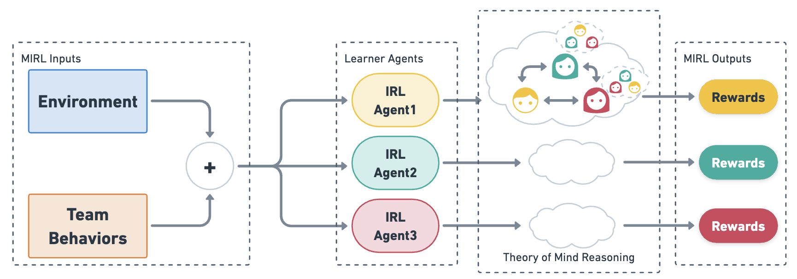

<!-- MARKDOWN LINKS & IMAGES -->
<!-- https://www.markdownguide.org/basic-syntax/#reference-style-links -->
[linkedin-shield]: https://img.shields.io/badge/-LinkedIn-black.svg?style=for-the-badge&logo=linkedin&colorB=555
[linkedin-url]: https://linkedin.com/in/haochenwu

[python-shield]: https://img.shields.io/badge/python-3.8%20%7C%203.9%20%7C%203.10-lightblue
[python-url]: https://github.com/usc-psychsim/mirl-tom-aamas23

[![python_version][python-shield]][python-url]

<!-- ABOUT THE PROJECT -->
# Multiagent Inverse Reinforcement Learning via Theory of Mind Reasoning

**To understand *how people interact* with each other in collaborative settings,
especially when individuals *know little about each other*.**

[Haochen Wu](https://haochenw.info),
[Pedro Sequeira](https://www.sri.com/bios/pedro-sequeira/),
[David V. Pynadath](https://people.ict.usc.edu/~pynadath/)

**Publication**: [AAMAS '23 paper](https://dl.acm.org/doi/abs/10.5555/3545946.3598703) |
[Preprint version](https://arxiv.org/abs/2302.10238) | [One-page overview](https://haochenw.info/research/atomic)

<center></center>

<!-- INSTALLATION -->
## Installing MIRL-ToM

1. Clone the repo.
   ```sh
   git clone https://github.com/usc-psychsim/mirl-tom-aamas23.git
   cd mirl-tom-aamas23
   ```
2. Install packages; Go to the working directory.
   ```sh
   python setup.py install
   cd model_learning
   ```

   (Alternative) Using `-e` allows local development without needing to re-install packages.
   ```shell
   pip install -e .
   ```

## Getting Started

***Example Environment*** (`environments/property_gridworld.py`)
- Dynamics of location property information
- Collaboration Dynamics
- Reward features for agent roles
- Add agent models

***Environment Testing*** (`examples/property_world_trajectories.py`)
- Test dynamics
- Generate GT trajectory and .gif

***Data Collection + Model Inference***
(`/examples/property_world_trajectories_with_inference.py`)
- Generate GT trajectory with inference, saved to .pkl
- If want to change models, use add_agent_models() in property_gridworld.py

(`/examples/reward_model_multiagent_inference.py`)
- Add inference to the collected trajectories

(`/examples/load_trajs.ipynb`)
- Generate plots

***MIRL with ToM*** (`/examples/multiagent_ToM_property_world_irl.py`)
- Line 68 of this code to switch learner agent
- Line 557-563 of trajectory.py to switch model distribution

***Getting Stats of FC and Policy Divergence*** (`/examples/test_property_world_divergence.py`)
- EVALUATE_BY = 'EPISODES': get policy divergence
  + make sure to set the reward weights of "learner team" (line 125-148)
  + and the reward weights of "team" (line 77-100) should be the GT rewards
- EVALUATE_BY = 'FEATURES': get empirical and estimated FCs
- EVALUATE_BY = 'EMPIRICAL': get empirical FCs
  + make sure the reward weights of "team" (line 77-100) are the learned rewards

## Citing MIRL-ToM
If you find MIRL-ToM useful for your research work, please cite it as follows.

Bibtex:
```text
@inproceedings{wu2023mirl-tom,
    author = {Wu, Haochen and Sequeira, Pedro and Pynadath, David V.},
    title = {Multiagent Inverse Reinforcement Learning via Theory of Mind Reasoning},
    year = {2023},
    isbn = {9781450394321},
    publisher = {International Foundation for Autonomous Agents and Multiagent Systems},
    booktitle = {Proceedings of the 2023 International Conference on Autonomous Agents and Multiagent Systems},
    pages = {708–716},
    numpages = {9},
    keywords = {cooperation, theory of mind, decentralized equilibrium, inverse reinforcement learning, multiagent systems},
    location = {London, United Kingdom},
    series = {AAMAS '23}
}
```
